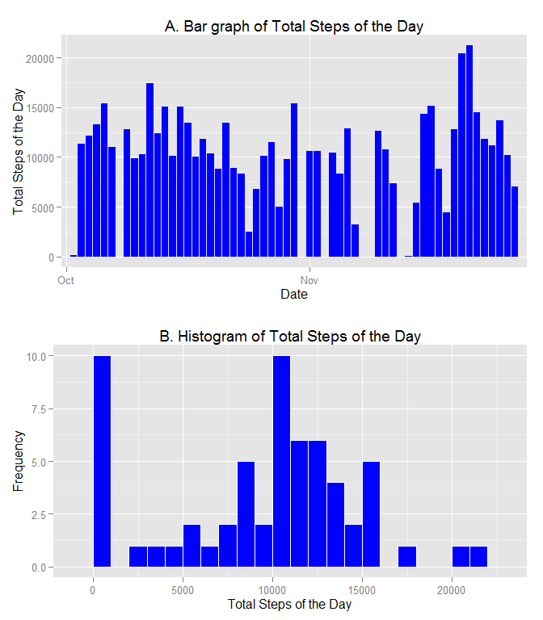
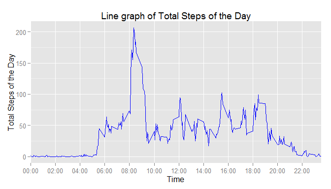
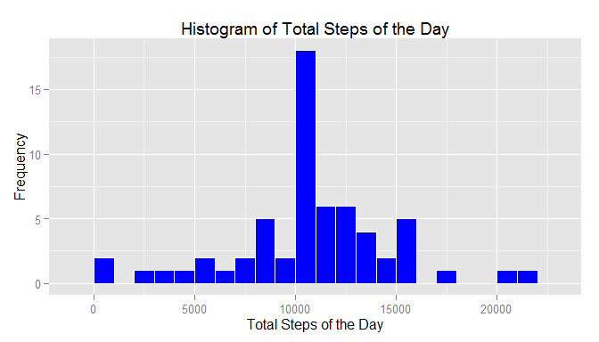
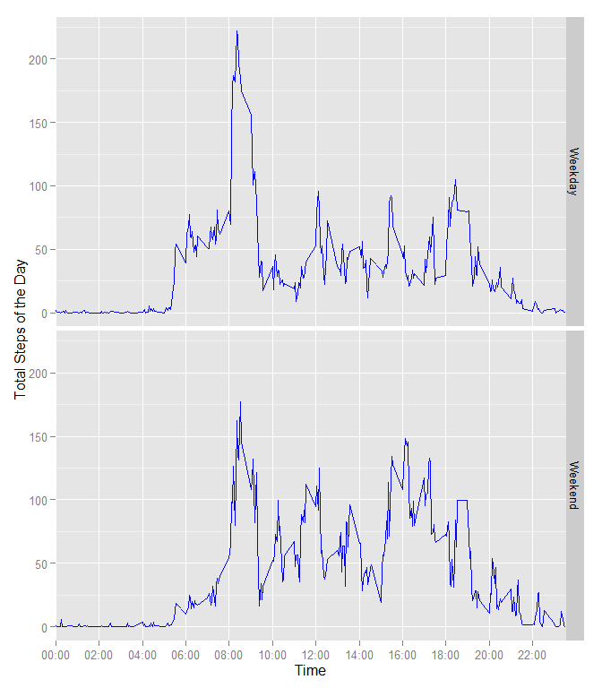

# Reproducible Research: Peer Assessment 1


## Loading and preprocessing the data

###1. Load the data 
    
    load the data from .csv file


```r
data <- read.csv("activity.csv")
head(data)
```

```
##   steps       date interval
## 1    NA 2012-10-01        0
## 2    NA 2012-10-01        5
## 3    NA 2012-10-01       10
## 4    NA 2012-10-01       15
## 5    NA 2012-10-01       20
## 6    NA 2012-10-01       25
```

```r
summary(data)
```

```
##      steps                date          interval     
##  Min.   :  0.00   2012-10-01:  288   Min.   :   0.0  
##  1st Qu.:  0.00   2012-10-02:  288   1st Qu.: 588.8  
##  Median :  0.00   2012-10-03:  288   Median :1177.5  
##  Mean   : 37.38   2012-10-04:  288   Mean   :1177.5  
##  3rd Qu.: 12.00   2012-10-05:  288   3rd Qu.:1766.2  
##  Max.   :806.00   2012-10-06:  288   Max.   :2355.0  
##  NA's   :2304     (Other)   :15840
```

###2. Process/transform the data (if necessary) into a format suitable for your analysis

    set the date to objects of POSIXct class


```r
data$date <- as.POSIXct(strptime(data$date, format = "%Y-%m-%d"))
```


## What is mean total number of steps taken per day?

###1.Calculate the total number of steps taken per day

    the total steps per day is calculated with NAs removed


```r
library(plyr)
Total <- ddply(data, .(date), summarize, Total = sum(steps, na.rm = TRUE))
```

###2. If you do not understand the difference between a histogram and a barplot, research the difference between them. Make a histogram of the total number of steps taken each day

    The bar graph (Figure 1A) shows the total steps per day on time scale, and the histogram (Figure 1B)summarize the frequency of the total steps per day on a 1000 steps interval.


```r
library(ggplot2)
library(grid)
library(scales)

## the first day of each month
locs<- which(format(Total$date,format = "%d") == "01") 
breaks <- Total$date[seq(1,length(Total$date), by = 32)]

## bar graph, not required in the assignment
p1 <- ggplot(Total, aes(x= as.character(date), y= Total)) +
        geom_bar(stat = "identity", fill = "blue") +
        xlab("Date") +
        ylab("Total Steps of the Day") +
        ggtitle("A. Bar graph of Total Steps of the Day") +
        scale_x_discrete(breaks = factor(breaks), labels = format(breaks, "%b"))

## histogram
p2 <- ggplot(Total, aes(x= Total)) +
        geom_histogram(col = "white", fill = "blue", binwidth = 1000) +
        xlab("Total Steps of the Day") +
        ylab("Frequency") +
        ggtitle("B. Histogram of Total Steps of the Day")

grid.newpage()
pushViewport(viewport(layout = grid.layout(2, 1)))

print(p1, vp = viewport(layout.pos.row = 1, layout.pos.col = 1))
print(p2, vp = viewport(layout.pos.row = 2, layout.pos.col = 1))
```

 


###3. Calculate and report the mean and median of the total number of steps taken per day


```r
mean <- mean(Total$Total)
median <- median(Total$Total)
```

The average steps taken per day is **9354.2295082**, and the median of it is **10395**.


## What is the average daily activity pattern?

###1. Make a time series plot (i.e. type = "l") of the 5-minute interval (x-axis) and the average number of steps taken, averaged across all days (y-axis)


```r
Daily <- ddply(data, .(interval), summarize, Average = mean(steps, na.rm = TRUE))

## ticks on x axis of every 2 hours
start<- as.POSIXct(strptime("00:00:00", format = "%H:%M:%S"))
time <- seq(start, along.with = Daily$interval, by = 5*60)
breaks <- which(format(time,"%M")=="00" & as.numeric(format(time,"%H")) %% 2 == 0)

p <- ggplot(Daily, aes(x= interval, y= Average,group =1))+
        geom_line(colour = "blue") +
        xlab("Time") +
        ylab("Total Steps of the Day") +
        ggtitle("Line graph of Total Steps of the Day") +
        scale_x_discrete(breaks = factor(Daily$interval[breaks]), labels = format(time[breaks], "%H:%M"))
print(p)
```

 

###2. Which 5-minute interval, on average across all the days in the dataset, contains the maximum number of steps?

```r
ind <- which.max(Daily$Average)
val <- Daily$Average[ind]
timeind <- format(time[ind], "%H:%M")
```
The maximam number of steps is at interval **104** , which is at **08:35** of the day.  
The number of steps is **206.1698113**


## Imputing missing values

###1. Calculate and report the total number of missing values in the dataset (i.e. the total number of rows with NAs)

```r
NumNAs <- nrow(data[!complete.cases(data),])
```
The total number of missing values in the dataset is **2304**.

###2. Devise a strategy for filling in all of the missing values in the dataset. The strategy does not need to be sophisticated. For example, you could use the mean/median for that day, or the mean for that 5-minute interval, etc.

    merge the data set and daily activity pattern to make mean of 5-minute interval available for the original dataset. find the missing values(NAs) in steps


```r
newset <- merge(data, Daily, by = "interval")

NAs <- which(is.na(newset$steps))
```


###3. Create a new dataset that is equal to the original dataset but with the missing data filled in.

    replace NAs with mean for the 5-minute interval and save it to the new dataset


```r
newset[NAs, "steps"] <- newset[NAs,"Average"]
```

###4. Make a histogram of the total number of steps taken each day and Calculate and report the mean and median total number of steps taken per day. Do these values differ from the estimates from the first part of the assignment? What is the impact of imputing missing data on the estimates of the total daily number of steps?

    Calculate the total number of steps taken each day

```r
Total.New <- ddply(newset, .(date), summarize, Total = sum(steps))
```

    Plot the histogram of the total number of steps taken each day


```r
## histogram
p <- ggplot(Total.New, aes(x= Total)) +
        geom_histogram(col = "white", fill = "blue", binwidth = 1000) +
        xlab("Total Steps of the Day") +
        ylab("Frequency") +
        ggtitle("Histogram of Total Steps of the Day")

print(p)
```

 

    Calculate the mean and median of the new dataset


```r
mean.New <- mean(Total.New$Total)
mean.New
```

```
## [1] 10766.19
```

```r
median.New <- median(Total.New$Total)
median.New
```

```
## [1] 10766.19
```
The average steps taken per day is 1.0766189\times 10^{4}, and the median of it is 1.0766189\times 10^{4}.  

After replacing missing value with the mean of 5-minute interval, the mean value of the total steps of the day becomes the median of the original data. The median of the new dataset is the same as the one of the original.

## Are there differences in activity patterns between weekdays and weekends?

###1. Create a new factor variable in the dataset with two levels - "weekday" and "weekend" indicating whether a given date is a weekday or weekend day

    New column called "Weekend" is added to new dataset.


```r
library(chron)
newset[,"Weekend"]<- is.weekend(newset$date)
newset$Weekend <- factor(newset$Weekend, labels = c("Weekday","Weekend"))
```

    Calculate the activity pattern according to the new column value

```r
Daily.New <- ddply(newset, .(interval, Weekend), summarize, Average = mean(steps, na.rm = TRUE))
```


```r
p <- ggplot(Daily.New, aes(x= interval, y= Average,group = Weekend))+
        geom_line(colour = "blue") +
        facet_grid(Weekend~.) +
        xlab("Time") +
        ylab("Total Steps of the Day") +
        scale_x_discrete(breaks = factor(Daily.New$interval[breaks*2]), labels = format(time[breaks], "%H:%M"))

print(p)
```

 
